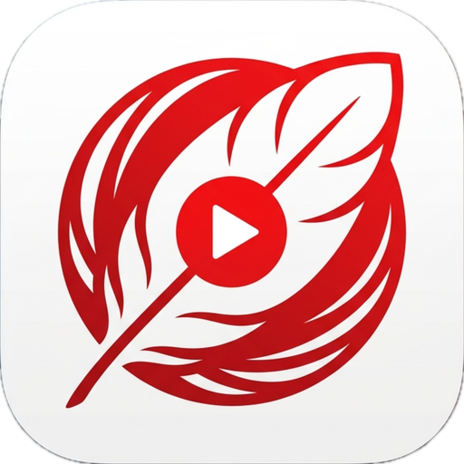
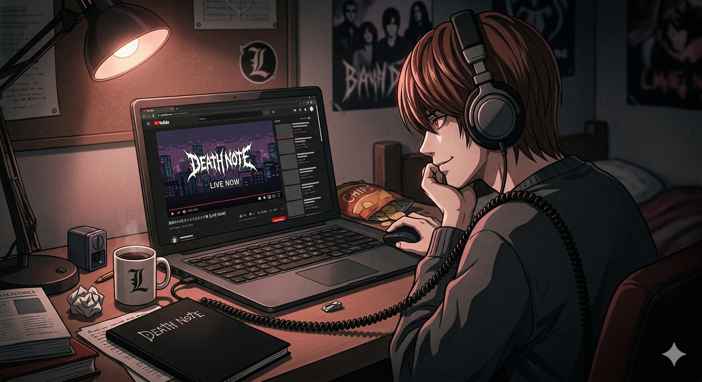

<p align="center">
  
</p>

# YTM Yagami

> *It's light.*

<p align="center">
  
</p>

A lightweight desktop app for YouTube Music, built with [Tauri](https://tauri.app). Uses your system's native webview instead of bundling Chromium — so it's fast, tiny, and won't eat your RAM.

## Features

- Native desktop window for YouTube Music
- OS media controls (play/pause/next/previous via keyboard media keys)
- Track change notifications with album art
- ~5 MB download (vs ~200 MB for Electron-based alternatives)

## Status

macOS is the supported platform. Linux and Windows build from source and run, but
**native notifications are macOS-only** right now — the notification bridge is
implemented against `UNUserNotificationCenter`. Media controls work on all three.

There is no signed release yet, so the only install path today is building from
source. See [docs/RELEASING.md](docs/RELEASING.md) for what signing still needs.

## Build from source

You'll need [Node.js](https://nodejs.org) (v18+) and [Rust](https://rustup.rs) installed.

```sh
git clone https://github.com/chug2k/ytmdesktop.git
cd ytmdesktop
npm install
npx tauri build
```

The built app will be in `src-tauri/target/release/bundle/`.

## Development

```sh
npm install
npx tauri dev
```

## Tests

```sh
npm test                      # JS (vitest + jsdom)
cd src-tauri && cargo test    # Rust
```

Lint, matching what CI enforces:

```sh
cd src-tauri
cargo fmt --check
cargo clippy --all-targets -- -D warnings
```

## Lineage

This started life as a fork of [ytmdesktop/ytmdesktop](https://github.com/ytmdesktop/ytmdesktop),
an excellent Electron-based YouTube Music desktop app, and the original is worth
your attention if you want a more featureful, more mature application.

YTM Yagami no longer shares any code with it. The Electron application was
replaced wholesale by a Rust/Tauri one; nothing from the original source tree
survives. The debt is one of inspiration and prior art, not of code.

Not affiliated with Google or YouTube.
